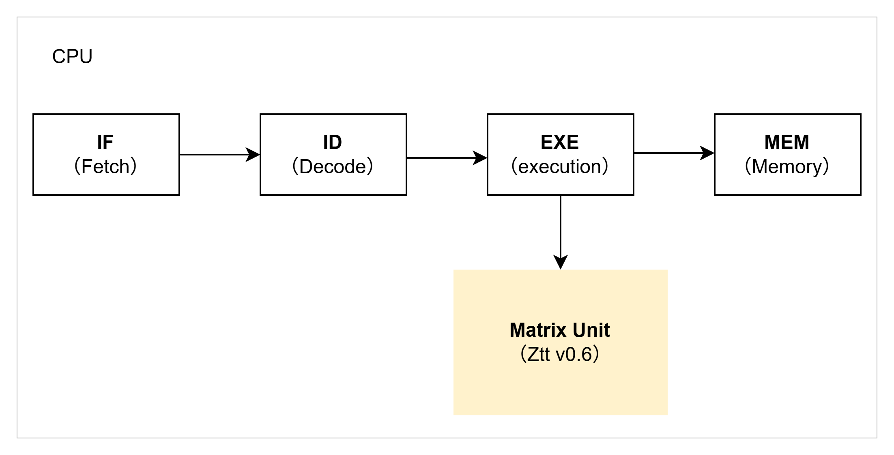

# AME_gem5: AME Instruction Set Extension for gem5

AME_gem5 is an open-source simulation and validation environment built upon the gem5 system-level simulator, specifically designed to provide comprehensive support for the Attached Matrix Extension (AME) instruction set. It is our expectation that this gem5 simulator will provide support for AME functional verification, performance modeling, and analysis. We actively encourage contributions from the broader community to collaboratively develop and refine this simulator, and thereby advance the optimization and architectural design of the AME extension.



## Key Features

- **AME Ztt v0.6 Instruction type supported**
  - Resource Management
  - Datatype Management
  - Elementwise Arithmetic
  - Bitwise
  - Compare and Predication
  - Permutation
  - Register move / data conversion
  - Elementwise Math Functions
  - Memory
  - State Management
  - Matrix Multiply
  - Reduction

See the community release of spec Ztt v0.6 for details.

## Quick Start

### Prerequisites

- A C++ compiler, Python 3, SCons, and the other gem5 dependencies. See the [gem5 build documentation](https://www.gem5.org/documentation/general_docs/building/).
- Git with submodule support.

### Build gem5

In the AME_gem5 root directory:

```sh
scons build/RISCV/gem5.opt -j$(nproc)
```

Then, install the packaged AME LLVM and GNU RISC-V toolchain:

```sh
./scripts/build_toolchain.sh
```
### Run examples and tests

Build and test an operator example:

```sh
make -C example gemm_fp32
```

Build and test all operators:

```sh
make -C example test
```

On Ubuntu 24.04.3 LTS, instruction, operator, and function-level tests pass.

## License

New AME_gem5 code is distributed under the BSD three-clause license in
[LICENSE](LICENSE). The original gem5 code and its existing per-file
copyrights remain covered by [COPYING](COPYING) and the notices in each file.
Third-party components retain their own `LICENSE`, `COPYING`, or `NOTICE`
terms.
